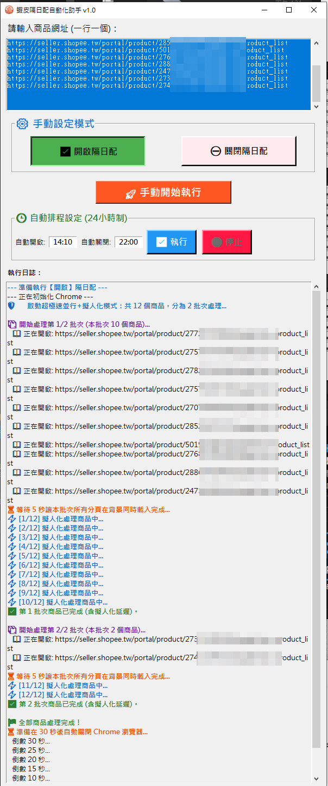
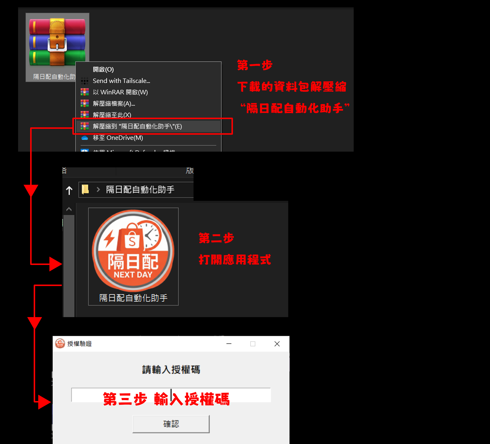
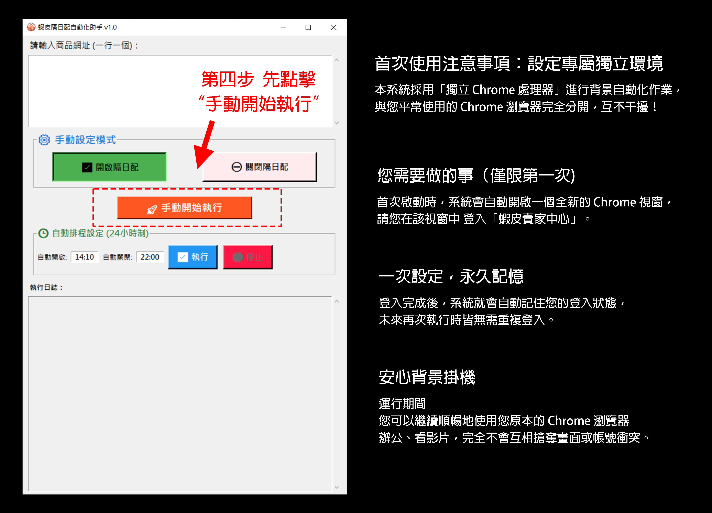
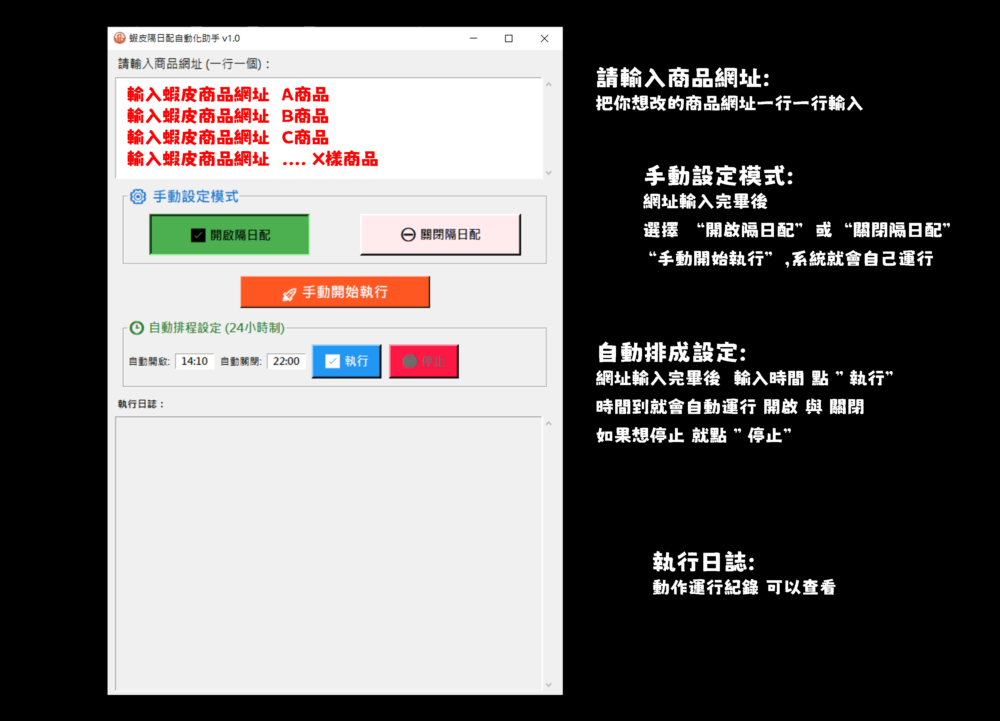

# Shopee 隔日配自動化助手

此工具用於協助蝦皮賣家快速批量開啟 / 關閉「隔日到貨」。
- 聯繫方式  LINE:  HKSSA
- 歡迎聯繫  7天免費使用授權碼

## 下載程式
👉 [點我下載最新版](https://github.com/hk821112-wq/Shopee-NextDay-Automation/releases/latest)

## 說明介紹
- 功能介紹
- 網址紀錄             :    你只需要輸入過的網址 就會一直記錄在上面 下次打開 網址依然還在 直接啟動
- 執行日誌             :    運行紀錄 在做甚麼 運行到哪都可以看
- 模式運行             :    手動設定模式  與  自動化排程模式
- 網址輸入防呆    :    大量輸入商品網址 會有重複的可能性  加入智慧防呆 避免重複網址
- 網頁背景運行    :    另開一個 Google chrome 背景運行 你可以 上網 處理蝦皮回覆 看影片...等等
- 擬人化運行操作:    模擬真人操作頓挫感  不會像機器人般的固定(秒數)運行

## 使用介紹

## 功能特色
- 批量處理商品
- 支援手動 / 自動排程
- 擬人化操作，降低風控
